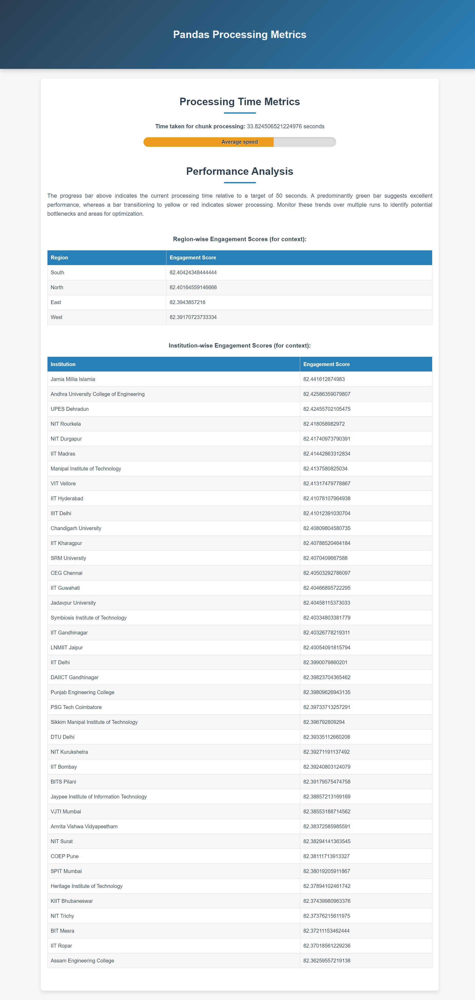
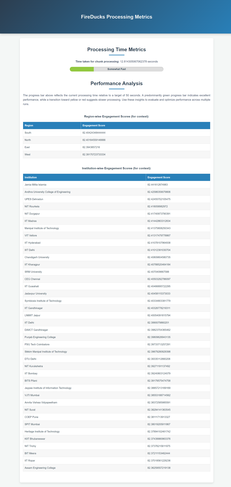

---

# Comparison of Pandas, FireDucks, and Polars APIs for Engagement Score Calculation

## Overview

This project compares the time taken by the **pandas**, **FireDucks**, and **Polars** libraries for processing large datasets and calculating engagement scores in a classroom monitoring system. The workflow is designed to:

1. Generate a large CSV dataset (default: 5 million rows).
2. Process the dataset to compute engagement scores (region scores, institution scores, and overall engagement).
3. Compare performance metrics (processing time and memory usage) across the three libraries.

## Steps to Set Up and Run the Application

### 1. Generate CSV Data

Before running the application, you need to generate the sample CSV dataset containing engagement data for classrooms. To generate the data:

1. Open a terminal in your **Linux** environment.
2. Navigate to the directory where the project is located.
3. Run the following command to generate the CSV data:

    ```bash
    python3 generator.py
    ```

By default, this will generate a CSV file with **50 lakh (5 million)** rows of data. The CSV file will be used for processing in the next steps.

### 2. Running the Application

Once the CSV file is generated, you can run the application to compare the performance of **pandas**, **FireDucks**, and **Polars** in processing the data.

1. In the terminal, make sure you’re in the project directory.
2. Run the Flask application using the following command:

    ```bash
    python3 app.py
    ```

This will start the web application and the backend will begin processing the generated CSV data using all three libraries (pandas, FireDucks, and Polars).

> **Note**: Make sure you have installed the necessary dependencies:
> ```bash
> pip install -r requirements.txt
> ```
> This should include **pandas**, **polars**, and any other libraries (Flask, etc.). FireDucks is assumed to be installed or available in your environment.

### 3. User Interface

After the application is up and running, open your web browser and navigate to:

```
http://127.0.0.1:5000
```

The interface provides the following functionalities:

- **FireDucks Report**: Process the dataset using FireDucks.
- **Pandas Report**: Process the dataset using pandas.
- **Polars Report**: Process the dataset using Polars.

Each action will take some time to process, depending on the size of the dataset.

### 4. Time Considerations

- Each report button may take between **3 to 5 minutes** to run, depending on the dataset size and your machine’s resources.
- By default, the dataset contains **5 million** rows of data, which can significantly affect processing time.
- The actual processing duration can vary based on CPU, RAM, and other system resources.

### 5. Results

The application provides a detailed report and comparison metrics, such as:

- **Region Scores**  
- **Institution Scores**  
- **Overall Engagement Score**  
- **Time taken for processing chunks using FireDucks**  
- **Time taken for processing chunks using pandas**  
- **Time taken for processing chunks using Polars**  

Use these results to compare how each library handles large-scale data processing.

## Example Screenshots

Below are some example screenshots illustrating the reports and the dashboard:

- **Dashboard**  
  

- **Polars Report Example**  
  

- **Pandas Report Example**  
  

- **FireDucks Report Example**  
  

Each report displays region-wise, institution-wise, and overall engagement metrics, along with processing times for each library.

## Conclusion

By integrating **pandas**, **FireDucks**, and **Polars** into the same workflow, you can easily compare performance characteristics and choose the most efficient tool for your data processing needs. This project demonstrates how each library handles:

- Large data ingestion and chunk processing
- Aggregation and grouping operations
- Calculation of engagement metrics for a classroom monitoring system

Feel free to modify the dataset size, experiment with different system configurations, and extend the analysis for deeper insights.

## Warning

- **Processing time may vary**: Depending on the dataset size and your machine’s resources, each action may take **3 to 5 minutes** (or more) to complete.
- **Default dataset size**: By default, the dataset contains **5 million** rows, which can significantly impact performance.
- **Linux environment**: The instructions provided are tailored for a Linux-based environment. If you’re running this on a different operating system, you may need to adjust the commands accordingly.

---